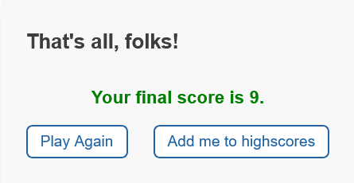
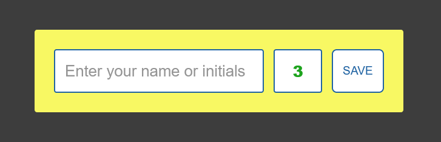
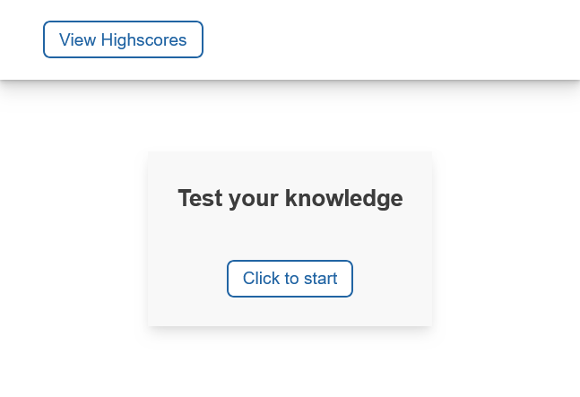

# Multiple-Choice Quiz

## Description

This project is an example of using JavaScript to handle user interaction and manipulate the DOM accordingly. It consists of a 9-question, multiple-choice, times quiz. 

Uses of JavaScript in this project include:

- Activating a timer and displaying the seconds as they count down.
- Manipulating the DOM, including HTML elements, as well as their 'class' and 'id' attributes.
- Keeping track of score and time.
- Handling click events on multiple targets.
- Handling click events on the same target differently, depending on the 'id' attribute.

## Installation

The Quiz can be accessed simply by opening the `index.html` file in any browser.

## Usage

Users can start the quiz by clicking the appropriate button, then answer questions and try to beat the ticking timer. 

Time is subtracted from the times with each incorrect answer. After answering all questions, the user is given the opportunity to add their name or initials to the highscores page, which is stored in the browser's local storage. 

The highscores page can also be accessed by clicking the appropriate button.

## Credits

All work is my own. Many thanks to the JavaScript teachers I have learned from on Coursera, Udemy, and the UMN Coding Bootcamp.

## License

MIT License

Copyright (c) 2024 Alex Geer

Permission is hereby granted, free of charge, to any person obtaining a copy
of this software and associated documentation files (the "Software"), to deal
in the Software without restriction, including without limitation the rights
to use, copy, modify, merge, publish, distribute, sublicense, and/or sell
copies of the Software, and to permit persons to whom the Software is
furnished to do so, subject to the following conditions:

The above copyright notice and this permission notice shall be included in all
copies or substantial portions of the Software.

THE SOFTWARE IS PROVIDED "AS IS", WITHOUT WARRANTY OF ANY KIND, EXPRESS OR
IMPLIED, INCLUDING BUT NOT LIMITED TO THE WARRANTIES OF MERCHANTABILITY,
FITNESS FOR A PARTICULAR PURPOSE AND NONINFRINGEMENT. IN NO EVENT SHALL THE
AUTHORS OR COPYRIGHT HOLDERS BE LIABLE FOR ANY CLAIM, DAMAGES OR OTHER
LIABILITY, WHETHER IN AN ACTION OF CONTRACT, TORT OR OTHERWISE, ARISING FROM,
OUT OF OR IN CONNECTION WITH THE SOFTWARE OR THE USE OR OTHER DEALINGS IN THE
SOFTWARE.
